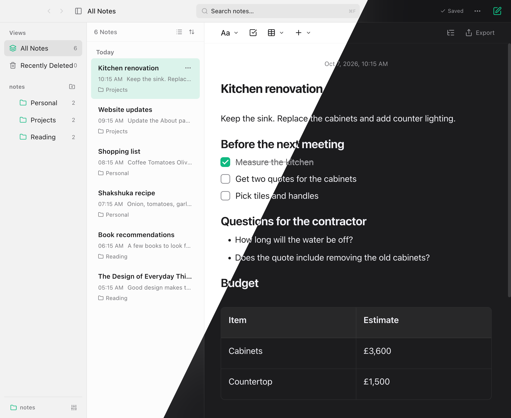

# Scribe

A visual Markdown editor for macOS, with support for Hebrew and English. Notes are saved as `.md` files in a folder you choose.

[Download for macOS](https://github.com/matanby/scribe/releases/tag/v1.0.0)

Full screenshots: [Light](docs/images/scribe-main.png) · [Dark](docs/images/scribe-dark.png)

- Format text, checklists, tables, code, and images in the editor.
- Write in Hebrew and English in the same note. Paragraphs, lists, and checkboxes follow each block’s writing direction.
- Open existing Markdown files, search your notes, and capture a note from another app with Quick Capture.
- Save automatically and restore earlier versions from local history.

## Download

Scribe runs on macOS Big Sur (11) or later.

- [Apple silicon (arm64)](https://github.com/matanby/scribe/releases/download/v1.0.0/Scribe-1.0.0-arm64.dmg)
- [Intel (x64)](https://github.com/matanby/scribe/releases/download/v1.0.0/Scribe-1.0.0-x64.dmg)
- [Browse all releases](https://github.com/matanby/scribe/releases)

Open the DMG, drag Scribe to Applications, then eject the DMG. The current release is not notarized by Apple, so macOS may ask you to confirm the first launch. Control-click Scribe, choose **Open**, then confirm. If needed, use **System Settings → Privacy & Security → Open Anyway**.

## Your notes, your folder

Choose **Open Notes Folder…** to pick where your notes live. A folder managed by Google Drive or another sync service works too; that service handles syncing. Attachments sit in an assets folder beside your notes. Version History is stored locally on this Mac.

## A few shortcuts

- **⌘N** — New note
- **⌘F** — Find in the current note
- **⌘⇧F** — Find and replace
- **⌃⌥⌘N** — Quick Capture (default; change it in Settings)

See **Help → Keyboard Shortcuts** in the app for the full list. For details on editing, attachments, tables, and version history, see the [feature reference](docs/reference.md).

## Build from source

On a Mac with Node.js 22 or later:

    npm ci
    npm run dist

The DMGs are written to release/. GitHub Actions builds Apple silicon and Intel versions when a version tag is pushed.

## License

Scribe is available under the [MIT License](https://github.com/matanby/scribe/blob/main/LICENSE).
