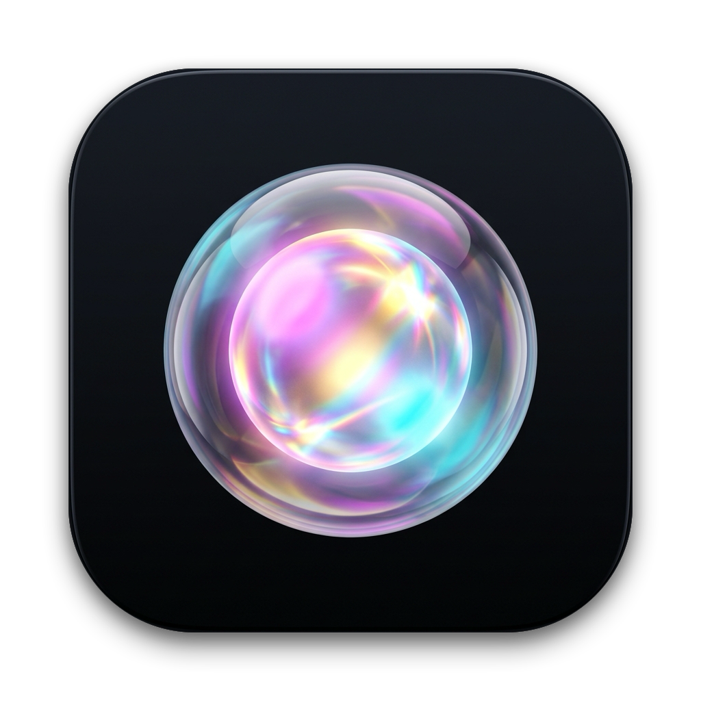

  
  <h1>Scribe</h1>
  
<strong>Markdown that feels like a document.</strong> 
  A calm, visual writing space for notes that stay yours — including when you write in Hebrew and English.

  
 &nbsp; <a href="https://github.com/matanby/scribe/releases">All releases</a>

## Why Scribe?

Markdown is a great way to keep notes portable, but writing around markup can interrupt your train of thought. Many visual note apps make writing feel effortless, then keep your notes in a format tied to that app.

Scribe brings those two things together: a clean rich-text editor, with every note saved as a standard Markdown file in a folder you choose. Open the same files in another Markdown app whenever you like.

Scribe supports Hebrew and English side by side: paragraph direction adapts as you write, and lists and checkboxes align with the language in each block.

## Made for everyday notes

- **Write visually.** Format headings, lists, links, tables, checklists, code, and images without staring at Markdown syntax.
- **Keep your files.** Open existing Markdown notes and save them as ordinary files on your Mac.
- **Work in your language.** Automatic right-to-left and left-to-right direction, including for lists and tasks.
- **Find your way back.** Search notes, use Quick Capture, and restore an earlier version.

## Download

Scribe runs on macOS Big Sur (11) or later.

- [Apple silicon (arm64)](https://github.com/matanby/scribe/releases/download/v1.0.0/Scribe-1.0.0-arm64.dmg)
- [Intel (x64)](https://github.com/matanby/scribe/releases/download/v1.0.0/Scribe-1.0.0-x64.dmg)
- [Browse all releases](https://github.com/matanby/scribe/releases)

Open the DMG, drag Scribe to Applications, then eject the DMG. The current release is not notarized by Apple, so macOS may ask you to confirm the first launch. Control-click Scribe, choose **Open**, then confirm. If needed, use **System Settings → Privacy & Security → Open Anyway**.

## Your notes, your folder

Choose **Open Notes Folder…** to pick where your notes live. A folder managed by Google Drive or another sync service works too; that service handles syncing. Attachments sit in an assets folder beside your notes. Version History is stored locally on this Mac.

## A few shortcuts

- **⌘N** — New note
- **⌘F** — Find in the current note
- **⌘⇧F** — Find and replace
- **⌃⌥⌘N** — Quick Capture (default; change it in Settings)

See **Help → Keyboard Shortcuts** in the app for the full list.

## Build from source

On a Mac with Node.js 22 or later:

    npm ci
    npm run dist

The DMGs are written to release/. GitHub Actions builds Apple silicon and Intel versions when a version tag is pushed.
